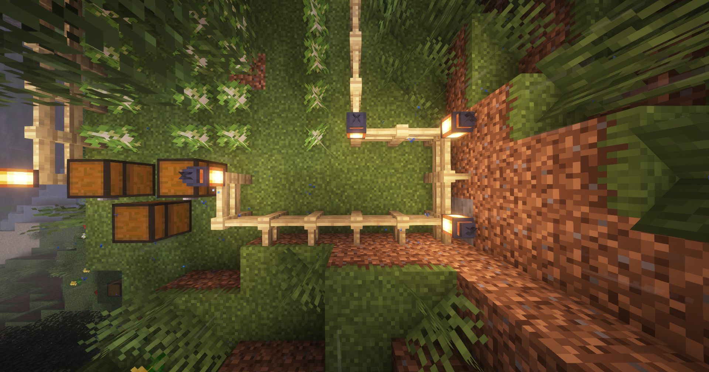

# ComputerCraft Turtle Automatic Fell Program

##### A program made in lua for the Minecraft mod CC:tweaked (ComputerCraft:tweaked) that automatically plants and cuts down trees while managing its inventory and resources.

### Arguments

#### Verbosity

Verbosity enables verbose messages in the turtle terminal, logging all activity. Errors and warnings will still be shown with Verbosity off.

#### SafeDig

SafeDig is a featured that, when enabled, will prevent the turtle from mining "unauthorized" blocks (blocks that are not part of felling). This ensures that if the turtle gets lost, confused or in any way behave incorrectly, it won't interfere with the environment and will wait for a user to manually remove the block.

This setting is recommended to be enabled as not to cause unintentional griefing. Foliage interfereing with the felling process (including descending when done) will automatically be cleared and is not affected by this setting.

#### Horizontal Scale

Horizontal scale defines how many forward/backward pairs to traverse. So for the value of 1, the turtle will traverse _one_ forward pass, and _one_ backward pass before returning.

Total space required: `Horizontal length * 6`.

Make sure to leave a tail of 3 blocks one vertical step behind first vertical plant space after the last backward pass as seen here:

#### Vertical Scale

Vertical scale defines how many blocks in depth to traverse. The starting-block of the turtle is not included.

Total space required: `Vertical length + 2`.

Make sure to leave the one row extra at the start (excluding chests) and at the end to enable the turtle to turn.
